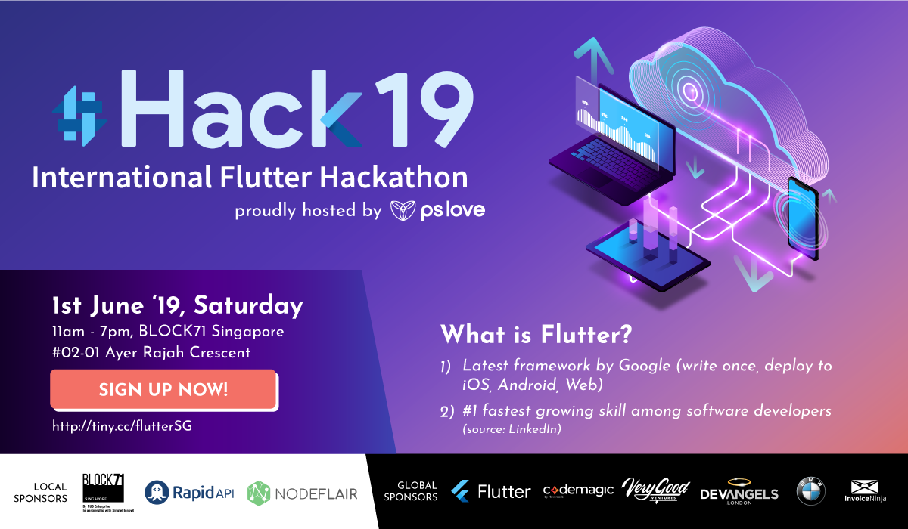

# #Hack19: International Flutter Hackathon 2019 [Singapore Edition]

    

## How to Use and Contribute

* Go through the Table of Contents and choose the tool.
* Search for a keyword or phrase (for example, "animation", "bloc").
* Ask [Caleb](https://github.com/calebjoseph), [Jason](https://github.com/grandnexus) and [Haris](https://github.com/happyharis) on [Flutter Singapore Telegram Group](https://t.me/joinchat/BTfmlhF5xvOq8_92iiZJIQ).

## Table of Content
* [#Hack19](#hack19)
* [RapidAPI](#rapidapi)
* [Introduction to Flutter](#introduction-to-flutter)
* [Getting Started](#getting-started)
* [Samples](#samples)
* [Courses](#courses)
* [Animations](#animations)
* [State Management](#state-management)
* [JSON and Serialization](#json-and-serialization)
* [Firebase](#firebase)

<main>

<article id="hack19">

### #Hack19: International Flutter Hackathon 2019

World's first ever all-day International Flutter™ Hackathon organised by over 2 dozen communities worldwide!

* [Flutter Hackathon Global Registration](https://docs.google.com/forms/d/e/1FAIpQLSdnr863wtBp9c0EZ50MXF5vo8t4odhB9M7-vYR063AmWwpXYw/viewform) — global registration form for voting your favourite project all over the world created by [Flutter Hackathon](https://flutterhackathon.com).
* [Flutter Hackathon YouTube Live Streaming](https://www.youtube.com/channel/UCNUzIz3TsiHSbgn_66kLIww) — global live streaming of Flutter hackathon hubs all over the world created by [Flutter Hackathon](https://flutterhackathon.com).
* [Flutter Hackathon Getting Started](https://flutterhackathon.com/#getting-started) — getting started resources specially made for #Hack19: International Flutter Hackathon 2019 created by [Flutter Hackathon](https://flutterhackathon.com).

</article>

<article id="rapidapi">

### RapidAPI

Building Blocks to Supercharge your App with RapidAPI!

* [RapidAPI API Credit Request Form](https://docs.google.com/forms/d/e/1FAIpQLSev-1Fm9hvZBIT_EVuTEJnHg5wC-A2o-7yRhRXWIJwZJPg8sA/viewform) — API credits specially made for #Hack19: International Flutter Hackathon 2019  by [RapidAPI](https://rapidapi.com).
* [RapidAPI Slack Invitation](https://join.slack.com/t/rakutenrapidapipublic/shared_invite/enQtNjA1MTY5MzI5MTM2LTVhNGUwOGEyNWMxY2FiYzMyYjliMjdjYzRjNjY1NDFhNTFmYTJjMjEyN2FiY2RiMDc1NjBiZWYyZDE3MmY2OTI) — <Hack the Hackathon/>100 Killer APIs for Hackathon Winners by [RapidAPI](https://rapidapi.com).
* [Flutter Curated Collection](https://english.api.rakuten.net/collection/flutter) — curated APIs specially made for #Hack19: International Flutter Hackathon 2019 by [RapidAPI](https://rapidapi.com).
* [Killer APIs for Hackathons](https://re.tc/fqq894do) — <Hack the Hackathon/> 100 Killer APIs for Hackathon Winners by [RapidAPI](https://rapidapi.com).

</article>

<article id="introduction-to-flutter">

### Introduction to Flutter

Flutter is Google’s portable UI toolkit for building beautiful, natively-compiled applications for mobile, web, and desktop from a single codebase.

* [Flutter Official Website](https://flutter.dev) — flutter landing page with docs, showcase and community support created by [Flutter](https://github.com/flutter).
* [Flutter YouTube Channel](https://youtube.com/flutterdev) — official flutter-related videos including flutter updates, tutorials and talks.
* [Introduction to Flutter Webinar](https://www.youtube.com/watch?v=DoAlr0DUJYw) — introduction to Flutter video created by [Brian Egan](https://twitter.com/brianegan).
* [What’s Revolutionary about Flutter](https://hackernoon.com/whats-revolutionary-about-flutter-946915b09514) — brief introduction to Flutter by [Hackernoon](https://hackernoon.com)
* [The Magic of Flutter](https://docs.google.com/presentation/d/1qCLySOMfpeyl49JoHiYboG2pJXDt_ZFluyLISZ375lM/edit?usp=sharing) — brief introduction to Flutter by [Tim Messerschmidt](https://twitter.com/SeraAndroid)
* [Let's Try Flutter](https://docs.google.com/presentation/d/1WWcopfXRsr5iWrHFYPNVC4rqykhf_sPEHhXVN_riefM) — brief introduction to Flutter by [GDG Ahmedabad](http://gdgahmedabad.com)
* [Introduction to Dart VM](https://mrale.ph/dartvm) — a high-level overview of the Dart VM and then proceeds to describe various components of the VM in great details by [Vyacheslav Egorov](https://mrale.ph)

</article>

<article id="getting-started">

### Getting Started

Resources that help you get started at record time!

* [Official Flutter Tutorials](https://flutter.dev/docs/reference/tutorials) — flutter tutorials created by [Flutter](https://github.com/flutter).
* [Official Flutter Cookbook](https://flutter.dev/docs/cookbook) — flutter cookbook created by [Flutter](https://github.com/flutter).
* [Official Flutter Codelabs](https://flutter.dev/docs/codelabs) — flutter codelabs created by [Flutter](https://github.com/flutter).
* [Getting Started with Flutter](https://www.raywenderlich.com/116-getting-started-with-flutter) — getting started tutorial created by [raywenderlich.com](raywenderlich.com).

</article>

<article id="samples">

### Samples

Amazing sample apps that cover different topics and features of Flutter!

* [Official Curated Samples](https://github.com/flutter/samples/blob/master/INDEX.md) — curated samples created by [Flutter](https://github.com/flutter).
* [Community Curated Samples](https://github.com/Solido/awesome-flutter) — curated samples created by [Solido](https://github.com/Solido).
* [Flutter by Example Samples](https://flutterbyexample.com/) — Flutter samples created by [Eric Windmill](https://ericwindmill.com).
* [Flutter UI Kit Samples](https://github.com/iampawan/Flutter-UI-Kit) — Flutter UI kit samples created by [iampawan](https://github.com/iampawan).

</article>

<article id="courses">

### Courses

Free and paid courses that give you great knowledge about Flutter!

* [Build Native Mobile Apps with Flutter](https://www.udacity.com/course/build-native-mobile-apps-with-flutter--ud905) — official Flutter short course created by [Flutter](https://github.com/flutter).
* [The Complete Flutter Development Bootcamp Using Dart](https://www.appbrewery.co/p/flutter-development-bootcamp-with-dart) — Welcome to the Complete Flutter App Development Bootcamp with Dart created by [The App Brewery](https://www.appbrewery.co) in collaboration with [Flutter](https://github.com/flutter).

</article>

<article id="animations">

### Animations

Flutter animations made easy with 60/120 fps smooth performance at great speed!

* [Animations in Flutter](https://medium.com/flutter-community/animated-widgets-in-flutter-763fd5dd6d01) — introduction to animations in Flutter by [HappyHaris](https://github.com/happyharis).
* [Implicitly Animated Widgets in Flutter](https://medium.com/flutter-community/animated-widgets-in-flutter-763fd5dd6d01) — simplifying animations in Flutter with implicitly animated widgets by [Flutter Community](https://medium.com/flutter-community).

</article>

<article id="state-management">

### State Management

Great variety of state management patterns to keep your data organized with integrity and consistency!

* [Reddit Post on Clean Architecture in Flutter](https://www.reddit.com/r/FlutterDev/comments/7zyd5z/whats_best_approach_to_clean_architecture_in) — comparison between different state management patterns in Flutter.
* [Introduction to Redux in Flutter](https://blog.novoda.com/introduction-to-redux-in-flutter) — explain how you can start writing mobile apps with Flutter using the Redux architecture by [Novoda](https://blog.novoda.com).
* [You Might Not Need Redux: The Flutter Edition](https://proandroiddev.com/you-might-not-need-redux-the-flutter-edition-9c11eba006d7) — TL;DR: setState -> scoped_model -> redux by [ProAndroidDev](https://proandroiddev.com).
* [Fish Redux](https://github.com/alibaba/fish-redux) — an assembled flutter application framework by [Alibaba](https://github.com/alibaba).

</article>

<article id="json-and-serialization">

### JSON and Serialization

Complex data serialization made simple with generated codes!

* [Official JSON and Serialization Guide](https://flutter.dev/docs/development/data-and-backend/json) — explain JSON solution to use in different scenarios by [Flutter](https://github.com/flutter).
* [Parsing complex JSON in Flutter](https://medium.com/flutter-community/parsing-complex-json-in-flutter-747c46655f51) — different rules of JSON structure in Flutter by [Flutter Community](https://medium.com/flutter-community).

</article>

<article id="firebase">

### Firebase

Firebase integrations with Flutter makes mobile development easy and yet powerful!

* [Enabling Firebase Cloud Messaging Push Notifications with Flutter](https://medium.com/flutterpub/enabling-firebase-cloud-messaging-push-notifications-with-flutter-39b08f2ed723) — step by step tutorial on Firebase Cloud Messaging by [FlutterPub](https://medium.com/flutterpub).

</article>

</main>